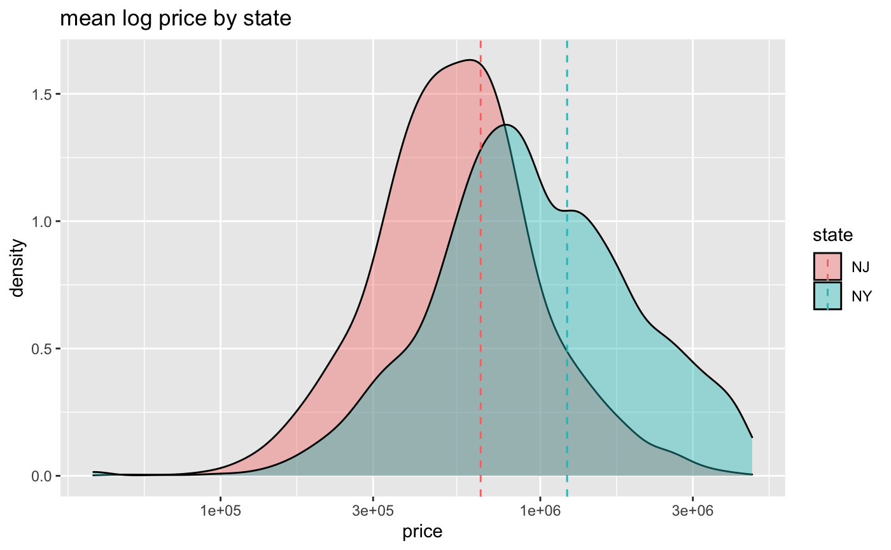

title: Predicting Real Estate Prices in New York City Using Natural Language Processing and Machine Learning Algorithms

author:
  - name: Lauren Low
    email: llow@smith.edu
    affiliation: Smith College
  - name: Dayana Meza
    email: dmeza@smith.edu
    affiliation: Smith College
  - name: Emma Scott
    email: escott@smith.edu
    affiliation: Smith College
  - name: Xian (Elaine) Ye
    email: xye@smith.edu
    affiliation: Smith College
  - name: Yanwan Zhu
    email: yzhu62@smith.edu
    affiliation: Smith College

address:
  - code: Smith College
    address: Smith College, 1 Chapin Way, Northampton, MA 01063

abstract: |
  Will add this in our final draft 
  

bibliography: mybibfile.bib
output: rticles::plos_article
csl: plos.csl
---


# Introduction

The largest investments an individual makes over the course of their lifetime is often the purchase of real estate. 
Traditionally, home valuation has been conducted by professional property appraisers – those licensed and hired to give an opinion of a home’s value, based on prices of neighboring homes, property analysis and judgment. 
In recent years though, there has been an uptick in models and algorithms for estimating housing price. 
Companies like Zillow, Trulia, and others have developed machine learning models to automate the job of an appraiser. 
These organizations take into account housing attributes including property size, number of bedrooms, number of bathrooms, geographic location, state of the economy, among other variables to predict home prices.  

StreetEasy, launched in 2006 and acquired by Zillow in 2013, is reshaping the way people buy, sell and rent property in New York City and New Jersey. 
Similar to Zillow’s Zestimate, StreetEasy’s existing predictive tool uses metrics on bedrooms, bathrooms, property size, and geographic features to estimate particular listing prices.
While these physical features of a property are certainly important to intergrate in models to predict housing price, researchers have found that basic features alone are not enough to differentiate price for houses that have similar features, and the text descriptions may contain more details of a property that could potentially impact the price.  

There has been an increasing interests in using natural language processing (NLP) to explore whether text information, such as customers’ reviews on short-term rentals or property descriptions, could further denote the quality of a property and improve the predictive accuracy of rental or housing price. 
Among these studies, different NLP techniques, including doc2vec, word extractions, and sentiment analysis, have been applied and shown to improve machine learning models when adding to the basic features model. 
@vargas2019model examine tokens in listing descriptions that are correlated with price (e.g., “swimming pool”, “remodel”) and find that the gradient boost model with text descriptions based on doc2vec performed better than the one that only uses property features. 
Using sentiment analysis of customers’ reviews on Airbnb as proxy of listing quality, @lawani2019reviews extracted the words associated with positive or negative emotions from the reviews and derived a sentiment score for each listing of Boston Airbnb. 
Results suggest sentiment scores performed better at predicting host price than a single rating indicator that asks customers how satisfied they were using a scale from 1 to 5. 
Adopting a more unstructured method, @shen2021information extract the attributes (e.g., “graceful”) from textual descriptions and quantified the uniqueness of a property, and it turns out the uniqueness of property increases the accuracy of prediction model. 

## Research Questions and Objectives
Considering text features are able to increase prediction accuracy based on previous literature, a primary objective of this project is to convert text-based listing descriptions into input variables for the purpose of improving predictive model accuracy. 
In particular, we investigate whether listing descriptions can be utilized to create meaningful features to improve the accuracy of predicting home prices. 

Some research questions include:

- Can we use listing attributes to predict home prices?
- Can we convert the description text into meaningful features?
- Can we use text-based features in addition to the existing features to predict home prices?

Many questions already have preliminary answers.
In StreetEasy’s current model, home prices are predicted using variables such as number of bedrooms, number of bathrooms, property size, time to subway, year the property was built and property neighborhood/geographic coordinates.
To predict home prices more accurately, we include the listing description in the model.
Using bag-of-words method and word embeddings to extract keywords, our analysis has yielded some key phrases such as “stainless steel,” “washer dryer,” “windows,” “storage,” “central park” and “closet space”. 
In addition, we are interested in conducting sentiment analysis to derive an affect score that indicates how positive a textual description is. 

In asking and answering these questions our goal is to improve upon StreetEasy’s existing machine learning algorithm by combining current models with text-based analysis to predict home prices.
By creating new variables from the listing descriptions,we aim to improve prediction accuracy. We plan to conduct random forest models and use Mean Absolute Percentage Error (MAPE) and Root Mean Squared Error (RMSE) to evaluate our models.  


# Methods

## Data and Variables

The data provided by our project partner includes two datasets on sale listings and amenities.
StreetEasy collects information from agents by having them directly enter listing information on the website or through a feed from their brokerage.
StreetEasy verifies the listing and property information based on records from New York City’s Department of Finance and Department of Buildings.

Our main data set consists of 59,661 sale listings of 52639 unique properties listed and/or sold on Streeteasy in 2019.
It has 31 variables including home price, property attributes (e.g., the number of bedrooms, the number of bathrooms, size in square feet),  geospatial information (e.g. state, zipcode, latitude, latitude), and a text description of each listing.

**(Make a table of variable names and descriptions?)**

## Data Preprocessing

**(More description/plots of EDA here?)**
Exploratory data analyses show that the distributions of the variables are skewed and 13 of them contain NA values for up to 11242 observations.
We performed data cleansing, reduction, and imputation to pre-process our data before running the analyses.
First, we select the 95% quantile of the non-zero values as a reasonable range of the listing prices.
We also filter out the outliers with unusually large values for property size and number of bedrooms and bathrooms.

In addition, we use zip codes to fill in an estimate for observations without valid latitude/longitude information and created more geographical variables such as city, county, and state using the R package zipcodeR that pulls information from U.S. Census data.
We perform these two steps because of the varying quality of geospatial information in the original data set.
First, some of the listings contain four-digit zip codes and erroneous longitude and latitude values such as (0, 0).
Secondly, the original location information about areas and neighborhoods was entered manually by agents, so the location variables do not have uniform criteria and may differ in the level of specificity.
Although the new geographic coordinates might not have street-level precision, by adding a leading zero to four-digit zip codes and incorporating associated features from the zipcodeR package, we are able to obtain geographic information that is consistent across listings. 

In order to prevent data leakage for our machine learning models, we remove the listings that appear more than once in the data set.
The duplicate listings are results of agents posting the same listing multiple times with updated information.
In order to eliminate duplicates, we first group the listings by `property_id` and keep the ones with the fewest NA values for all variables within each group.
Next, we select the rows with the longest listing descriptions and the largest number of bedrooms within each group.
Last, we use the distinct() function to keep one unique listing corresponding to each `property_id`. 

Because nearly 20% of the observations do not have values for the `size_sqft` variable, we plan to use the `mice` package to impute missing property size values by regression (`norm.predict`).
The predictors of the imputation consist of the number of bedrooms, the number of bathrooms, unit type, floor count, city, and state.

## Data Analysis Plans

In order to determine whether adding text features as predictors will improve the accuracy of predicting housing price, we first create models without text features and then compare their model evaluation metrics with those with extracted text features.
We select Root Mean Squared Log Error (RMSLE) as our evaluation metrics for the linear regression model; the smaller the RMSLE, the more accurate the model is in predicting the outcome.
To avoid overfitting and ensure the generalizability of our models, we plan to perform k-fold cross validation on each of our models and take the mean RMSLE as the metrics for comparison across models. 

To establish a baseline, we create a null model that only has mean log price as the predictor.
We expect all other models we build to have better prediction performances than the null model.

Models without text features.
We are working on building a linear regression model using log price as outcome and a decision tree/ random forest model that automatically predicts which categories of price range a listing falls into.
For the linear regression model, we plan to use stepwise selection to select the top 5 most significant predictors of housing price, build the model using those variables, conduct 5-fold cross validation, and then compute the mean RMSLE. 

## Models with Text Features

To convert the listing descriptions into meaningful text-based features, the words are (1) tokenized: the words inside of the listing descriptions are split into word or words (i.e., multiple words tokenzied together are called ‘n-grams’) known as tokens to create a one-token-per-row for text analysis; (2) vetted for stop words: removing words that have little to no meaningful information for analysis (e.g., ‘the’, ‘as’, ‘a’, ‘of’); (3) stemmed: finding the base or root of words (e.g., we want to categorize ‘windows’ the same as ‘window’), and lastly (4) analyzed for extracting keywords and n-grams.
**[add a sentence here about the benefits of including n-grams in model]**
N-grams generate words that commonly occur together and improve accuracy of sentiment analysis models @kruczekngrams[@pitler2010using].
This allows us to infer the value from text using regular expressions or models.


Different ways for featurizing text data:

- Define a target feature/tag such as “whether the apartment has been recently renovated” and infer the value from text using regular expressions or models
- Use bag-of-words method by counting the frequency of words observed in each document
- Use pre-trained word embeddings or train word embeddings

Current literature supports leveraging machine learning algorithms with natural language processing to improve prediction accuracy @chen2018integrating [@ivanov2020improving].

## Research Questions and Objectives
Some research questions include:

- Can we use listing attributes to predict home prices?
- Can we convert the description text into meaningful features?
- Can we use text-based features in addition to the existing features to predict home prices?

Many questions already have preliminary answers.
In StreetEasy’s current model, home prices are predicted using variables such as number of bedrooms, number of bathrooms, property size, time to subway, year the property was built and property neighborhood/geographic coordinates.
To predict home prices more accurately, we include the listing description text as tokens in the machine learning model. 
Using  bag-of-words method and word embeddings to extract keywords, our analysis has yielded some key phrases such as “stainless steel,” “washer dryer,” “windows,” “storage,” “central park” and “closet space”.

In asking and answering these questions our goal is to improve upon StreetEasy’s existing machine learning algorithm by combining current models with text-based analysis to predict home prices.
By creating new variables from the listing descriptions – binary variables for the term “stainless steel”, say – we aim to improve prediction accuracy.

# Methods

## Data and Variables

The data provided by our project partner includes two datasets on sale listings and amenities.
StreetEasy collects information from agents by having them directly enter listing information on the website or through a feed from their brokerage.
StreetEasy verifies the listing and property information based on records from New York City’s Department of Finance and Department of Buildings  @streeteasy_2019.

Our main data set consists of 59,661 sale listings of 52639 unique properties listed and/or sold on Streeteasy in 2019.
It has 31 variables including home price, property attributes (e.g., the number of bedrooms, the number of bathrooms, size in square feet),  geospatial information (e.g. state, zipcode, longitude, latitude), and a text description of each listing.

## Data Preprocessing

Exploratory data analyses show that the distributions of the variables are skewed and 13 of them contain NA values for up to 11242 observations.
We performed data cleansing, reduction, and imputation to pre-process our data before running the analyses.
First, we select the 95% quantile of the non-zero values as a reasonable range of the listing prices.
We also filter out the outliers with unusually large values for property size and number of bedrooms and bathrooms.

In addition, we use zip codes to fill in an estimate for observations without valid latitude/longitude information and created more geographical variables such as city, county, and state using the `zipcodeR` package that pulls information from U.S. Census data @zipcodeR_2020.
We perform these two steps because of the varying quality of geospatial information in the original data set.
First, some of the listings contain four-digit zip codes and erroneous longitude and latitude values such as (0, 0).
Secondly, the original location information about areas and neighborhoods was entered manually by agents, so the location variables do not have uniform criteria and may differ in the level of specificity.
Although the new geographic coordinates might not have street-level precision, by adding a leading zero to four-digit zip codes and incorporating associated features from the `zipcodeR` package, we are able to obtain geographic information that is consistent across listings. 

In order to prevent data leakage for our machine learning models, we remove the listings that appear more than once in the data set.
The duplicate listings are results of agents posting the same listing multiple times with updated information.
In order to eliminate duplicates, we first group the listings by `property_id` and keep the ones with the fewest NA values for all variables within each group.
Next, we select the rows with the longest listing descriptions and the largest number of bedrooms within each group.
Last, we use the `distinct()` function to keep one unique listing corresponding to each `property_id`. 

Because nearly 20% of the observations do not have values for the `size_sqft` variable, we plan to use the `mice` package to impute missing property size values by regression (`norm.predict`) @mice_2011.
The predictors of the imputation consist of the number of bedrooms, the number of bathrooms, unit type, floor count, city, and state.

After data cleaning, we eventually have 41327 listings in the data set. 
The number of bedrooms ranges from 0 to 36 with a mean of 2.58 (SD = 2.11). 
The number of bathrooms ranges from 0 to 20 with a mean of 1.13 (SD = 1.13). 
On average, the listings are located on the 10th floor, and were built in 1946. 
The distribution of `size` is skewed, with a mean of 1496 square feet but a large standard deviation (SD = 1120.27). 
Similarly, `price` also has a skewed distribution: the mean price is 1,125,424 dollars, but the standard deviation is over 870,000. 
In our analysis, we will log transform `size_sqrt` and `price` when necessary.

\begin{table}[htpb]\caption{Descriptive statistics for continuous variables}
\begin{center}
\begin{scriptsize} 
\begin{tabular} {l r r r r r r r r }
 \multicolumn{ 8 }{l}{ A table from the psych package in R } \cr 
 \hline Variable  &   {vars} &  {n} &  {mean} &  {sd} &  {medin} &  {min} &  {max} &  {range}\cr 
  \hline 
bedrooms   &  1  &  41327  &        2.58  &       2.11  &       2  &      0  &       36  &       36 \cr 
 bathrooms   &  2  &  41327  &        1.85  &       1.13  &       2  &      0  &       20  &       20 \cr 
 size\_sqft   &  3  &  31955  &     1496.34  &    1120.27  &    1190  &    100  &    36000  &    35900 \cr 
 floor\_count   &  4  &  41327  &        9.94  &      14.30  &       4  &      0  &       96  &       96 \cr 
 year\_built   &  5  &  35888  &     1946.03  &     161.83  &    1955  &      0  &     2021  &     2021 \cr 
 price   &  6  &  41327  &  1125434.27  &  874393.42  &  829000  &  40000  &  4599000  &  4559000 \cr 
 \hline 
\end{tabular}
\end{scriptsize}
\end{center}
\label{default}
\end{table}

Figure 1 shows the distributions of the log price of listings by state, and the vertical lines indicate the mean log price for each state. 
After log-transformation, the price variable is more normally distributed. In general, homes in New York State are more expensive than those in New Jersey.

```{r echo=FALSE, fig.cap="Log-transformed Distribution of Home Prices", out.width = "90%"}
 
```


## Data Analysis Plans

In order to determine whether adding text features as predictors will improve the accuracy of predicting housing price, we first create models without text features and then compare their model evaluation metrics with those with extracted text features.
We select Root Mean Squared Log Error (RMSLE) as our evaluation metrics for the linear regression model; the smaller the RMSLE, the more accurate the model is in predicting the outcome.
To avoid overfitting and ensure the generalizability of our models, we plan to perform k-fold cross validation on each of our models and take the mean RMSLE as the metrics for comparison across models. 

To establish a baseline, we create a null model that only has mean log price as the predictor.
We expect all other models we build to have better prediction performances than the null model.

Models without text features.
We are working on building a linear regression model using log price as outcome and a decision tree/ random forest model that automatically predicts which categories of price range a listing falls into.
For the linear regression model, we plan to use stepwise selection to select the top 5 most significant predictors of housing price, build the model using those variables, conduct 5-fold cross validation, and then compute the mean RMSLE. 

## Models with Text Features

To convert the listing descriptions into meaningful text-based features, the words are 
(1) tokenized: the words inside of the listing descriptions are split into word or words (i.e., multiple words tokenzied together are called ‘n-grams’) known as tokens to create a one-token-per-row for text analysis; 
(2) vetted for stop words: removing words that have little to no meaningful information for analysis (e.g., ‘the’, ‘as’, ‘a’, ‘of’); 
(3) stemmed: finding the base or root of words (e.g., we want to categorize ‘windows’ the same as ‘window’), and lastly 
(4) analyzed for extracting keywords and n-grams. 
N-grams generate words that commonly occur together and improve accuracy of sentiment analysis models @kruczekngrams[@pitler2010using].
These steps allow us to infer the value from the listing descriptions using regular expressions or models. 
A second method to featurize the text is the bag-of-words (BoW) approach. 
This model enables us to measure the presence of each word throughout all listing descriptions inside the database. 
In more technical terms, we measure the frequency of each token. 
A supplementary approach to the two methods indicated above is pre-trained word embeddings or train word embeddings. 
To contextualize the semantic relationship of terms, word embeddings examine the pairwise correlation between words. 
Assessing co-occurrences is critical in creating a highly predictive model.

# References {#references .unnumbered}
